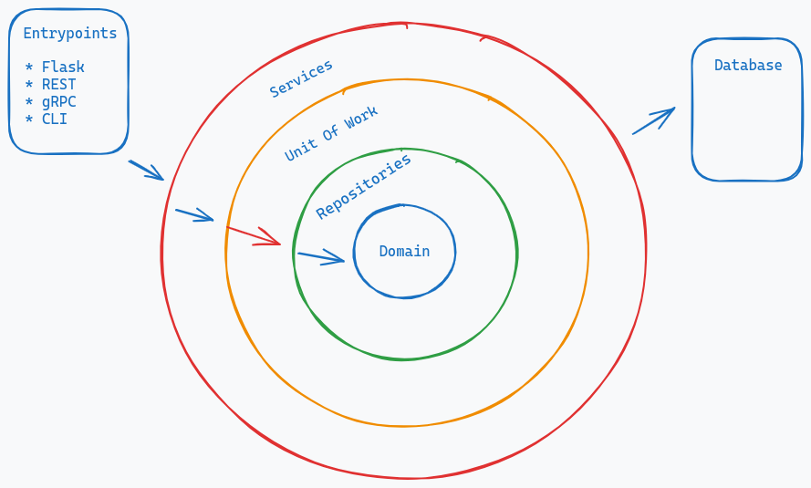

# Hexagonal Architecture with Flask and Dependency Injector

## FlaskCon 2023 walkthrough

[YouTube - Learn Flask the hard way: Introduce Architecture Patterns](https://www.youtube.com/watch?v=wrtCo2fBoD0)

## This project is a complete-rewritten version of official Flask tutorial using Hexagonal Architecture

[Flask Blog tutorial](https://flask.palletsprojects.com/en/2.2.x/tutorial/)

[Flask Blog tutorial code base](https://github.com/pallets/flask/tree/main/examples/tutorial/flaskr)

### About project dependencies

The project has 2 main dependencies:

[Dependency Injector](https://github.com/ets-labs/python-dependency-injector)

[Flask](https://github.com/pallets/flask)

### About Hexagonal Architecture

You can read it from original author:

[The Pattern: Ports and Adapters](https://alistair.cockburn.us/hexagonal-architecture/)

### Current implementation

Layers:



Hexagonal View:

TBD...

## How to install for development?

Use virtualenv as:

```console
python3 -m venv .venv
source .venv/bin/activate
```

We use flit for the installation:

* Install flit:

```console
pip install flit==3.8.0
```

* Install using make command for development:

```console
make install-dev
```

* Init the database

```console
make init-db
```

* Start development service:

```console
make run
```

## Other commands

* Format, sort the imports and also check the style

```console
make format
```

* Run linter for final check

```console
make lint
```

* Run tests all non-slow and non-integrated tests

```console
make test
```

* Run slow tests

```console
make test-slow
```

* Run integration tests

```console
make test-integration
```

* Run test coverage

```console
make test-cov
```

* Run type check

```console
make type-check
```

* Run security check

```console
make secure
```
